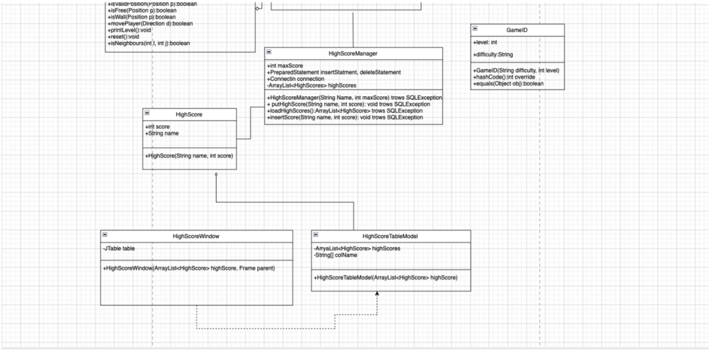

# Sofiia Isakova
# Task description:
Create the Labyrinth game, where objective of the player is to escape from this labyrinth. The player starts at the bottom left corner of the labyrinth. He has to get to the top right corner of the labyrinth as fast he can, avoiding a meeting with the evil dragon. The player can move only in four directions: left, right, up or down.
There are several escape paths in all labyrinths. The dragon starts off from a randomly chosen position, and moves randomly in the labyrinth so that it choose a direction and goes in that direction until it reaches a wall. Then it chooses randomly a different direction. If the dragon gets to a neighboring field of the player, then the player dies. Because it is dark in the labyrinth, the player can see only the neighboring fields at a distance of 3 units. Record the number of how many labyrinths did the player solve, and if he loses his life, then save this number together with his name into the database. Create a menu item, which displays a highscore table of the players for the 10 best scores. Also, create a menu item which restarts the game.
Take care that the player and the dragon cannot start off on walls.
# Analysis:
In this task, I created a simple puzzle game with a grid layout and a player that moves around the board. To begin, I created a GameLevel class that initializes the game board, sets up the player, the dragon, and the destination, and handles movement and game logic. The player moves with the arrow keys, and the dragon moves randomly on the grid. I used the Direction enumerator to control movement directions and the Position class to track coordinates. The MainWindowclass provides the user interface, allowing for game controls like starting new levels, adjusting zoom, and viewing high scores. Additionally, I implemented a timer to track the player's progress and display the number of steps taken.

# UML

# Methods:
• HighScoreManager(String Name, int maxScores): Initializes the HighScoreManager, connects to the database, and prepares a statement for deleting high scores.
• putHighScore(String name, int score): Adds or updates a player's high score in the database; deletes the old score if the player already exists and inserts the new one.
• loadHighScores(): Loads and returns the top 10 high scores from the database in descending order.
• insertScore(String name, int score): Inserts a new player's score into the high scores database.
• loadGame(GameID gameID): Loads a specific game level based on the provided GameID (difficulty and level).
• step(Direction d): Moves the player in the specified direction and returns whether the move was successful.
• isLevelLoaded(): Checks if a game level is currently loaded.
• readLevels(): Loads all game levels from resource files and adds them to the game.
• addNewGameLevel(GameLevel gameLevel): Adds a new game level to the game,
categorized by difficulty and level number.
• readNextLine(Scanner sc): Reads and returns the next non-empty line from the scanner.
• readGameID(String line): Parses a GameID from the provided line, extracting the
difficulty and level number.
• generateDragonPos(): Generates a random position for the dragon that is not occupied
by the player, destination, or a wall, and sets that position on the level.
• moveDragon(): Moves the dragon to a new position by choosing a random direction,
ensuring the new position is valid and free.
• chooseRandomDirection(): Randomly selects a direction for the dragon to move in.
• isValidPosition(Position p): Checks whether the given position is within the bounds of
the level.
• isFree(Position p): Checks if the given position is free (either empty or the destination).
• isWall(Position p): Checks if the given position is a wall.
• movePlayer(Direction d): Moves the player in the specified direction if the next position
is free, then moves the dragon and increments the step count.
• reset(): Resets the level to its initial state, restoring the player’s original position and
regenerating the dragon’s position.
• isNeighbours(int i, int j): Checks if the given position is adjacent to the dragon's
position.
• restartGame(): Resets the game state, stops the timer, reloads the game level, and starts
a new timer.
• startTimer(): Starts a timer to track the elapsed time during the game and updates the
game statistics every second.
• stopTimer(): Stops the timer and resets the elapsed time to zero.
• refreshGameStatLabel(): Updates the label that displays the current game statistics,
including steps taken, elapsed time, and player name.
• createGameLevelMenuItems(JMenu menu): Creates menu items for selecting different
game levels based on the available difficulty and levels.
• createScaleMenuItems(JMenu menu, double from, double to, double by): Creates menu items
for adjusting the zoom scale of the game board within the specified range and
increment.
• displayHighScores(): Fetches and displays the high scores from the database in a dialog
window using a table.
# Events and Handlers:
1. Key Press Event (keyPressed)
Event: User presses arrow keys or ESC.

Handler: Moves player or reloads the game, and checks if the player has won or lost. 
2. Menu Actions
2.1 Restart Game (menuGameRestart) Event: User clicks "Restart Game".
Handler: Calls restartGame(), resets game and timer. 
2.2 Exit Game (menuGameExit)
Event: User clicks "Exit".
Handler: Calls System.exit(0) to exit the app. 
2.3 High Scores (menuHighScore)
Event: User clicks "High Scores".
Handler: Displays high scores in a dialog (displayHighScores()). 
2.4 Level Selection
Event: User selects a difficulty/level.
Handler: Calls game.loadGame() to load the selected level. 
2.5 Zoom Scale Selection
Event: User selects zoom level.
Handler: Updates board scale (board.setScale()). 
3. Timer Actions
3.1 Start Timer (startTimer)
Event: Game starts or restarts.
Handler: Starts a timer to track elapsed time.
3.2 Stop Timer (stopTimer) Event: Game ends.
Handler: Stops the timer and resets elapsed time. 
3.3 Timer Action Listener

Event: Timer ticks every second.
Handler: Updates elapsed time and game statistics label. 
4. Game Status Label (refreshGameStatLabel)
Event: Game state updates.
Handler: Updates the game statistics (steps, time, player name). 
5. Game Level Reset (game.getLevel().reset())
Event: Game is restarted.
Handler: Resets the game state and player position. 
6. Level Loading (game.loadGame(game.getGameID()))
Event: User selects a new level.
Handler: Loads the selected level and refreshes the game board.

# Game
When I runs the program it asks for a player’s name

